# Setu Technical Design

## 1. Purpose

Setu is a local-first evidence platform for immigration petition preparation. The current implementation is optimized for teams who need to move from raw evidence folders to a reviewable legal organization system without losing source traceability, workspace isolation, or human override control.

Phase 1 adds a client lifecycle shell around the existing evidence pipeline. The architecture is now intentionally layered as:

1. client record
2. workspace intake
3. document-level understanding
4. event-level interpretation
5. criterion-level organization
6. human review and output packaging

Each layer is preserved instead of collapsed into one irreversible decision.

## 2. Architectural principles

The system follows these rules:

1. AI does the first pass; a human does the final judgment.
2. A client can own multiple isolated workspaces.
3. Every uploaded folder remains isolated by `jobId`.
4. Original files remain accessible through every stage.
5. Each AI pass is rerunnable without destroying upstream artifacts.
6. Review actions are reversible and workspace-scoped.
7. Client home and review pages should surface what needs attention first.

## 3. System overview

```mermaid
flowchart LR
  A["Client portfolio\n/clients"] --> B["Client record\nstorage/state/clients.json"]
  B --> C["Client home\n/clients/<clientId>"]
  C --> D["Workspace intake\n/?view=workspace&clientId=<clientId>"]
  D --> E["Job record\nstorage/state/jobs.json"]
  D --> F["Workspace files\nstorage/uploads/<jobId>"]
  F --> G["Extraction + normalization"]
  G --> H["Summary pass\nsrc/lib/ai.ts"]
  H --> I["Embedding pass\nsrc/lib/ai.ts"]
  I --> J["Qdrant document store\nsrc/lib/qdrant.ts"]
  J --> K["Workspace snapshot assembly\nsrc/lib/library.ts"]
  K --> L["Event bundling\nsrc/lib/event-bundles.ts"]
  L --> M["Bundle cache\nstorage/state/event-bundles.json"]
  M --> N["EB1A classification\nsrc/lib/eb1a-classification.ts"]
  N --> O["Classification cache\nstorage/state/eb1a-classification.json"]
  O --> P["Criteria tagging\nsrc/lib/criteria-tagging.ts"]
  P --> Q["Tagging cache\nstorage/state/criteria-tagging.json"]
  Q --> R["Manual overrides + review state"]
  B --> S["Client timeline\nstorage/state/clients/<clientId>/timeline.json"]
  R --> T["Client review page\n/clients/<clientId>/review"]
  R --> U["Dense workspace review\n/review/<jobId>"]
  O --> V["Output packages\nstorage/exports"]
```



## 4. Runtime stack

### Frontend

- Next.js 16 app router
- React 19
- Tailwind 4 utility styling
- Setu token system in [src/app/globals.css](../src/app/globals.css)

### Backend inside the app

- Next.js route handlers under `src/app/api`
- local filesystem persistence
- Qdrant for vector-backed document retrieval
- JSON state files for client, job, and derived-state persistence

### AI providers and models

- OpenAI text model for summarization, bundling, classification, tagging, and Ask Setu chat
- OpenAI embedding model for semantic retrieval

Current defaults come from [src/lib/settings.ts](../src/lib/settings.ts):

- summary model: `gpt-4.1-mini`
- embedding model: `text-embedding-3-small`
- embedding dimensions: `1024`

## 5. Persistence design

### 5.1 Qdrant

Qdrant stores the retrieval-oriented evidence document record and embedding together. It is the canonical store for indexed evidence documents.

Each stored point includes:

- workspace identity
- client and candidate context
- file metadata
- processing state
- document summary payload
- criteria tags
- review status
- notes and pin state
- usage metadata

Qdrant powers:

- semantic search
- workspace-level evidence retrieval
- document metadata hydration for review surfaces
- Ask Setu retrieval

### 5.2 JSON state

Operational and interpretation-layer state lives under `storage/state`.

- `settings.json`
  - prompts, model settings, output root
- `jobs.json`
  - indexing jobs, stage progress, cancellation state
- `clients.json`
  - top-level client registry
- `clients/<clientId>/client.json`
  - durable client record
- `clients/<clientId>/timeline.json`
  - lifecycle events for that client
- `event-bundles.json`
  - per-workspace bundle output
- `eb1a-classification.json`
  - per-workspace criterion output
- `criteria-tagging.json`
  - per-workspace evidence-level tags and review suggestions
- `manual-overrides.json`
  - human overrides for event assignment, bucket placement, and review state
- `review-state.json`
  - sub-bundles and review organization

### 5.3 Filesystem artifacts

The filesystem stores:

- original uploads in `storage/uploads`
- preview assets in `storage/previews`
- export packages in `storage/exports`
- local Qdrant files in `storage/qdrant`

## 6. Client and workspace model

Phase 1 introduces a formal client model.

### Client

A client record includes:

- `id`
- `displayName`
- `petitionType`
- lifecycle status
- created and updated timestamps
- optional filing target or decision metadata
- notes

Clients are managed in [src/lib/clients.ts](../src/lib/clients.ts).

### Workspace

A workspace remains the isolated AI-processing unit keyed by `jobId`.

Each workspace belongs to one client through `job.clientId`. Workspaces continue to enforce isolation in:

- document retrieval
- semantic search
- preview and source access
- event bundling caches
- classification caches
- tagging caches
- manual overrides
- output package generation

### Timeline

Important lifecycle actions are written to the per-client timeline in [src/lib/timeline.ts](../src/lib/timeline.ts), including:

- client creation
- migrated workspace attachment
- human review actions
- key override changes

## 7. Multi-pass intelligence

### 7.1 Pass 1: document summarization

Each reviewable file is extracted, summarized, and embedded.

This pass produces:

- title
- short summary
- detailed summary
- evidence value
- recommended use
- document type
- confidence
- primary date
- people
- organizations
- tags
- risk flags

### 7.2 Pass 2: event bundling

The bundling pass groups related documents into real-world events such as:

- speaking engagements
- judging activity
- employment roles
- project or initiative evidence
- authorship or publication efforts

Special structured role-document rules remain supported, including `CR`, `LR`, and `OC` event naming behavior.

### 7.3 Pass 3: bundle-level EB1A classification

Completed event bundles are assigned into:

- standard EB1A criteria
- `Archive Category`
- `Unwanted`
- `Human Review`

### 7.4 Pass 4: document-level criteria tagging

The tagging pass works at the evidence-file level and produces:

- criterion tags
- role
  - `primary`
  - `supporting`
- AI confidence
- rationale
- default review state
  - `kept`
  - `pending`
  - `archived`

## 8. Review architecture

Setu now has two review-oriented layers.

### Client review

The client review page is action-oriented and groups work by:

- actionable items still requiring human review
- category bands
- archive and cleanup bands
- routine evidence that is already stabilized

This page is designed for incremental work across multiple sessions.

### Dense workspace review

The job-level review page remains retrieval-heavy and is appropriate when the reviewer needs:

- semantic search
- bundle-level inspection
- criterion-first deep review
- targeted overrides on one workspace

## 9. Migration behavior

Phase 1 uses lazy migration for historical workspaces.

When older jobs are encountered:

- Setu creates client records from existing jobs if needed
- existing jobs are attached to the created client
- a client timeline entry is created

Default migration behavior is one client per historical workspace unless the data is later consolidated manually.

## 10. APIs introduced or emphasized in Phase 1

Client routes:

- `GET /api/clients`
- `POST /api/clients`
- `GET /api/clients/<clientId>`
- `PATCH /api/clients/<clientId>`
- `DELETE /api/clients/<clientId>`
- `GET /api/clients/<clientId>/timeline`

Existing workspace and evidence APIs continue to drive ingestion, review actions, previews, and overrides.

## 11. Ask Setu note

Ask Setu remains an additive layer on top of the indexed workspace substrate. It does not replace the client lifecycle model and should remain gated by workspace readiness.

## 12. Validation expectations

Baseline validation:

```bash
npm run lint
npm run build
```

Phase 1 validation should additionally confirm:

- `/` redirects to `/clients`
- `/clients` renders all clients
- `/clients/<clientId>` renders client home
- `/clients/<clientId>/review` renders the action-oriented review surface
- `/?view=workspace&clientId=<clientId>` preserves operational workbench access
- pending review actions update counts immediately and persist after reload
- workspace isolation remains intact across client views
