# Setu Technical Design

## 1. Purpose

Setu is a local-first evidence and petition-assembly platform for immigration preparation. The system is designed to move from raw evidence folders to a client-scoped, strategy-aware, draft-producing, packet-exporting workflow without losing source traceability, workspace isolation, or human override control.

The architecture is intentionally layered:

1. client record
2. workspace intake
3. document-level understanding
4. event-level interpretation
5. criterion-level organization
6. human review
7. client-wide strategy reasoning
8. lock and unlock
9. per-criterion drafting
10. synthesis
11. stitching and packet export

Each layer is preserved instead of collapsed into one irreversible decision.

## 2. Architectural principles

The system follows these rules:

1. AI does the first pass; a human does the final judgment.
2. A client can own multiple isolated workspaces.
3. Every uploaded folder remains isolated by `jobId`.
4. Original files remain accessible through every stage.
5. Each AI pass is rerunnable without destroying upstream artifacts.
6. Review actions are reversible and workspace-scoped.
7. Client home and review pages should surface what needs attention first.
8. Strategy, stress-test, and drafting outputs must remain client-scoped and citable.
9. Locked exhibit numbering must remain stable until explicit unlock.
10. Draft versions must be append-only and auditable.
11. Packet assembly must not mutate source drafts or source exhibits.

## 3. System overview

```mermaid
flowchart LR
  A["Client portfolio\n/clients"] --> B["Client registry\nstorage/state/clients.json"]
  B --> C["Client home\n/clients/<clientId>"]
  C --> D["Workspace intake\n/?view=workspace&clientId=<clientId>"]
  D --> E["Job record\nstorage/state/jobs.json"]
  D --> F["Workspace files\nstorage/uploads/<jobId>"]
  F --> G["Extraction + normalization"]
  G --> H["Summary pass\nsrc/lib/ai.ts"]
  H --> I["Embedding pass\nsrc/lib/ai.ts"]
  I --> J["Qdrant document store\nsrc/lib/qdrant.ts"]
  J --> K["Workspace snapshot assembly\nsrc/lib/library.ts"]
  K --> L["Event bundling\nsrc/lib/event-bundles.ts"]
  L --> M["Bundle cache\nstorage/state/event-bundles.json"]
  M --> N["EB1A classification\nsrc/lib/eb1a-classification.ts"]
  N --> O["Classification cache\nstorage/state/eb1a-classification.json"]
  O --> P["Criteria tagging\nsrc/lib/criteria-tagging.ts"]
  P --> Q["Tagging cache\nstorage/state/criteria-tagging.json"]
  Q --> R["Manual overrides + review state"]
  B --> S["Client timeline\nstorage/state/clients/<clientId>/timeline.json"]
  R --> T["Client review page\n/clients/<clientId>/review"]
  Q --> U["Ask Setu strategy surface\n/clients/<clientId>/strategy"]
  U --> V["Strategy memos + stress-tests\nstorage/state/clients/<clientId>"]
  V --> W["Lock flow\nsrc/lib/lock.ts"]
  W --> X["Locked case strategy + pinboards"]
  X --> Y["Drafting workspace\n/clients/<clientId>/drafting/<criterionCode>"]
  Y --> Z["Criterion drafts + versions\nstorage/state/clients/<clientId>/drafts"]
  Z --> AB["Synthesis workspace\n/clients/<clientId>/synthesis"]
  AB --> AC["Synthesis drafts + versions\nstorage/state/clients/<clientId>/synthesis"]
  AC --> AD["Stitching workspace\n/clients/<clientId>/stitching"]
  AD --> AE["Assembly + audit + Bates\nsrc/lib/assembly.ts"]
  AE --> AF["Packet PDF\nstorage/packets/<clientId>"]
  X --> AA["Output packages\nstorage/exports"]
```



## 4. Runtime stack

### Frontend

- Next.js 16 app router
- React 19
- Tailwind 4 utility styling
- Setu token system in [src/app/globals.css](../src/app/globals.css)

### Backend inside the app

- Next.js route handlers under `src/app/api`
- local filesystem persistence
- Qdrant for vector-backed document retrieval
- JSON state files for client, job, and derived-state persistence

### AI providers and models

- OpenAI text model for summarization, bundling, classification, tagging, Ask Setu, stress-testing, and draft generation
- OpenAI embedding model for semantic retrieval

Current defaults come from [src/lib/settings.ts](../src/lib/settings.ts):

- summary model: `gpt-4.1-mini`
- embedding model: `text-embedding-3-small`
- embedding dimensions: `1024`

## 5. Persistence design

### 5.1 Qdrant

Qdrant stores the retrieval-oriented evidence document record and embedding together. It is the canonical store for indexed evidence documents.

Each stored point includes:

- workspace identity
- client and candidate context
- file metadata
- processing state
- document summary payload
- criteria tags
- review status
- notes and pin state
- usage metadata

Qdrant powers:

- semantic search
- workspace-level evidence retrieval
- document metadata hydration for review surfaces
- Ask Setu retrieval
- criterion-scoped drafting retrieval

### 5.2 JSON state

Operational and interpretation-layer state lives under `storage/state`.

#### Global state

- `settings.json`
  - prompts, model settings, output root, active style profile
- `jobs.json`
  - indexing jobs, stage progress, cancellation state
- `clients.json`
  - top-level client registry
- `event-bundles.json`
  - per-workspace bundle output
- `eb1a-classification.json`
  - per-workspace criterion output
- `criteria-tagging.json`
  - per-workspace evidence-level tags and review suggestions
- `manual-overrides.json`
  - human overrides for event assignment, bucket placement, and review state
- `review-state.json`
  - sub-bundles and review organization

#### Per-client state

- `clients/<clientId>/client.json`
  - durable client record
- `clients/<clientId>/timeline.json`
  - lifecycle events for that client
- `clients/<clientId>/chat-sessions/*.json`
  - Ask Setu session history
- `clients/<clientId>/strategy-memos/*.json`
  - pinned strategy artifacts
- `clients/<clientId>/stress-test-reports/*.json`
  - pinned stress-test artifacts
- `clients/<clientId>/locked-strategy.json`
  - stable criteria mix, exhibits, and narrative spine
- `clients/<clientId>/pinboards/*.json`
  - per-criterion drafting anchors
- `clients/<clientId>/drafts/*.json`
  - append-only criterion draft versions and approval metadata
- `clients/<clientId>/synthesis/*.json`
  - append-only synthesis draft versions and approval metadata
- `clients/<clientId>/assembled-packet.json`
  - latest assembled petition state, findings, and PDF path

#### Style system state

- `style-profiles/*.json`
  - user-editable style profiles

### 5.4 Packet artifacts

Phase 4 adds `storage/packets/<clientId>/<packetId>.pdf` for preview and filable packet output.

### 5.3 Filesystem artifacts

The filesystem stores:

- original uploads in `storage/uploads`
- preview assets in `storage/previews`
- export packages in `storage/exports`
- local Qdrant files in `storage/qdrant`
- curated default exemplars in `storage/style-profiles/default.json`

## 6. Client and workspace model

### Client

A client record includes:

- `id`
- `displayName`
- `petitionType`
- lifecycle status
- created and updated timestamps
- optional filing target or decision metadata
- notes

Clients are managed in [src/lib/clients.ts](../src/lib/clients.ts).

### Workspace

A workspace remains the isolated AI-processing unit keyed by `jobId`.

Each workspace belongs to one client through `job.clientId`. Workspaces continue to enforce isolation in:

- document retrieval
- semantic search
- preview and source access
- event bundling caches
- classification caches
- tagging caches
- manual overrides
- output package generation

### Timeline

Important lifecycle actions are written to the per-client timeline in [src/lib/timeline.ts](../src/lib/timeline.ts), including:

- client creation
- migrated workspace attachment
- human review actions
- strategy generation
- lock and unlock
- draft approval

## 7. Multi-pass intelligence

### 7.1 Pass 1: document summarization

Each reviewable file is extracted, summarized, and embedded.

This pass produces:

- title
- short summary
- detailed summary
- evidence value
- recommended use
- document type
- confidence
- primary date
- people
- organizations
- tags
- risk flags

### 7.2 Pass 2: event bundling

The bundling pass groups related documents into real-world events such as:

- speaking engagements
- judging activity
- employment roles
- project or initiative evidence
- authorship or publication efforts

Special structured role-document rules remain supported, including `CR`, `LR`, and `OC` event naming behavior.

### 7.3 Pass 3: bundle-level EB1A classification

Completed event bundles are assigned into:

- standard EB1A criteria
- `Archive Category`
- `Unwanted`
- `Human Review`

### 7.4 Pass 4: document-level criteria tagging

The tagging pass works at the evidence-file level and produces:

- criterion tags
- role
  - `primary`
  - `supporting`
- AI confidence
- rationale
- default review state
  - `kept`
  - `pending`
  - `reference`
  - `archived`

## 8. Review architecture

Setu has two review-oriented layers.

### Client review

The client review page is action-oriented and groups work by:

- actionable items still requiring human review
- category bands
- a dedicated Reference band for documents held aside without counting toward coverage
- archive and cleanup bands
- routine evidence that is already stabilized

Each decision row on `/clients/<clientId>/review` supports visible `Assign criterion` and `Actions` triggers, plus a right-click context menu, for:

- keep as primary
- keep as supporting
- move to Reference
- move to Archive
- reassign criterion
- move to bundle
- Quick peek
- AI reasoning

Bundles in the human-review queue also expose a direct `Assign criterion` action so whole bundles can be routed into the correct criterion without reclassifying every evidence file one by one.

This page is designed for incremental work across multiple sessions.

### Dense workspace review

The job-level review page remains retrieval-heavy and is appropriate when the reviewer needs:

- semantic search
- bundle-level inspection
- criterion-first deep review
- targeted overrides on one workspace

## 9. Strategy and Ask Setu architecture

Ask Setu is an additive reasoning layer on top of the indexed evidence substrate.

### Readiness gate

The chat and strategy surfaces are enabled only when:

- the client has at least one workspace
- the active workspaces are fully indexed through tagging
- bundle classification and tagging state is completed
- coverage can be computed

### Mode structure

Phase 3 keeps four modes:

- `Triage`
- `Strategy`
- `Stress-test`
- `Draft`

The first three operate at client strategy scope. `Draft` operates at criterion scope and uses locked strategy plus criterion-scoped evidence retrieval.

Phase 4 extends `Draft` so the same mode can also generate synthesis sections when a synthesis kind is active.

### Citation contract

Setu does not allow factual draft or chat claims to survive without citations that resolve to client-visible documents. Draft mode adds a second layer on top of citation existence: fact-check drift detection against cited evidence.

## 10. Lock, drafting, synthesis, and stitching architecture

### Lock

The lock step turns client-wide strategy into durable downstream structure:

- primary and supporting criteria
- declined criteria with rationale
- stable exhibit labels
- narrative spine
- per-criterion pinboards
- criterion draft skeletons

Unlock invalidates the lock state but preserves draft history for auditability.

### Drafting

Each criterion has a `CriterionDraft` file that is append-only with respect to versions.

Each version stores:

- source (`ai`, `manual`, `ai-edited`)
- paragraph text
- exhibit references
- citations
- fact-check status
- generic prose warnings
- word count
- generation cost where relevant

The drafting workspace is a three-column surface:

- left: pinboard + locked strategy notes
- middle: editable draft on paper-like surface
- right: criterion-scoped Ask Setu

### Style profiles

Style profiles let attorneys steer Draft mode toward a specific legal voice. The active profile contributes 1 to 3 exemplars matching the current criterion, with fallback to related criteria if needed.

Phase 3 ships with a curated read-only default profile and supports user-created editable profiles.

### Synthesis

The synthesis layer introduces two `SynthesisDraft` records per client:

- `statement-of-eligibility`
- `final-merits-determination`

Each synthesis draft:

- is append-only by version
- can be approved independently
- cites both exhibits and approved criterion draft paragraphs
- reuses the fact-check and generic-prose infrastructure
- can draw from synthesis-specific exemplars in the active style profile

### Stitching

The stitching layer is deterministic and consumes approved upstream artifacts:

- locked strategy
- approved criterion drafts
- approved synthesis sections
- locked exhibit assignments and pinboards

It produces:

- ordered petition sections
- normalized exhibit references
- audit findings
- Bates ranges
- preview and filable packet PDFs

## 11. Migration behavior

Phase 1 uses lazy migration for historical workspaces.

When older jobs are encountered:

- Setu creates client records from existing jobs if needed
- existing jobs are attached to the created client
- a client timeline entry is created

Default migration behavior is one client per historical workspace unless the data is later consolidated manually.

## 12. API surface emphasized through Phase 4

### Client routes

- `GET /api/clients`
- `POST /api/clients`
- `GET /api/clients/<clientId>`
- `PATCH /api/clients/<clientId>`
- `DELETE /api/clients/<clientId>`
- `GET /api/clients/<clientId>/timeline`

### Strategy and lock routes

- `POST /api/chat/session`
- `POST /api/chat/turn`
- `GET /api/chat/artifacts`
- `POST /api/clients/<clientId>/lock`
- `POST /api/clients/<clientId>/unlock`

### Drafting routes

- `GET /api/clients/<clientId>/drafts`
- `GET /api/clients/<clientId>/drafts/<criterionCode>`
- `POST /api/clients/<clientId>/drafts/<criterionCode>`
- `PATCH /api/clients/<clientId>/drafts/<criterionCode>`
- `POST /api/clients/<clientId>/drafts/<criterionCode>/approve`
- `GET /api/clients/<clientId>/drafts/<criterionCode>/versions/<version>`
- `GET /api/style-profiles`
- `POST /api/style-profiles`
- `GET /api/style-profiles/<id>`
- `PATCH /api/style-profiles/<id>`
- `DELETE /api/style-profiles/<id>`
- `POST /api/style-profiles/<id>/exemplars`
- `PATCH /api/style-profiles/<id>/exemplars/<exemplarId>`
- `DELETE /api/style-profiles/<id>/exemplars/<exemplarId>`
- `GET /api/style-profiles/active`
- `POST /api/style-profiles/active`

### Synthesis and packet routes

- `GET /api/clients/<clientId>/synthesis`
- `POST /api/clients/<clientId>/synthesis/<kind>`
- `POST /api/clients/<clientId>/synthesis/<kind>/approve`
- `GET /api/clients/<clientId>/synthesis/<kind>/versions/<version>`
- `GET /api/clients/<clientId>/packet`
- `POST /api/clients/<clientId>/packet`
- `GET /api/clients/<clientId>/packet/preview`
- `GET /api/clients/<clientId>/packet/download`

## 13. Validation expectations

Baseline validation:

```bash
npm run lint
npm run build
```

Lifecycle validation should additionally confirm:

- `/` redirects to `/clients`
- `/clients` renders all clients
- `/clients/<clientId>` renders client home
- `/clients/<clientId>/review` renders the action-oriented review surface
- `/clients/<clientId>/strategy` renders coverage, memo, stress-test, and Ask Setu
- `/clients/<clientId>/lock` renders stable exhibit staging
- `/clients/<clientId>/drafting` renders the criterion queue
- `/clients/<clientId>/drafting/<criterionCode>` renders the full drafting workspace
- `/clients/<clientId>/synthesis` renders synthesis tabs, approved criterion references, and section-specific Ask Setu
- `/clients/<clientId>/stitching` renders readiness, sections, findings, and packet CTAs
- pending review actions update counts immediately and persist after reload
- workspace isolation remains intact across client views
- cross-client retrieval never leaks into strategy or drafts
- packet preview and packet generation succeed for a client with approved upstream artifacts
