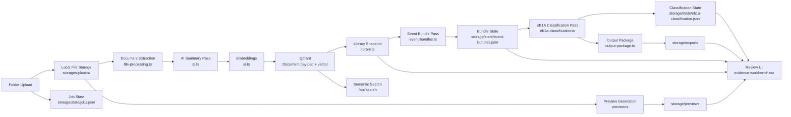

# Final Design Document

## 1. Purpose

EB1A Evidence Studio is a local-first evidence review system for candidate documentation. It is designed to help a user upload folders of evidence, generate grounded AI summaries for each file, organize related files into event bundles, classify those bundles into EB1A categories, route filename-based archive or unwanted files into dedicated review buckets, and review the resulting evidence record through a clear workspace UI.

The current product stage is intentionally focused on:

- intake
- summarization
- retrieval
- event grouping
- EB1A bundle classification
- human review
- output packaging

## 2. Product goals

The system is built around the following goals:

1. Keep all evidence local and inspectable.
2. Make every uploaded folder an isolated workspace.
3. Give the user readable AI summaries at both document and event levels.
4. Preserve the original documents and make them previewable with one click.
5. Track OpenAI cost transparently.
6. Allow the AI review prompt to be edited without adding infrastructure complexity.
7. Save a downstream output package with organized evidence, references, and a human-review queue.

## 3. Current user workflow

1. The user enters a `Candidate name` in the workspace profile.
2. The user optionally edits the active prompts in `Prompt Library`.
3. The user selects a folder and clicks `Index Folder`.
4. The system runs the review pipeline in order:
   - `Indexing documents`
   - `Bundling events`
   - `Classifying EB1A`
   - `Ready to review`
   - the user can cancel an active run, and the system stops at the next safe stage boundary
5. While event bundling is queued or processing, the user can still review completed document summaries in a flat evidence table.
6. Once bundling completes, the workspace becomes event-reviewable even if EB1A classification is still queued or processing.
7. Once classification completes, the same event bundles are enriched with criterion assignments, archive and unwanted routing, unclassified review state, and output-package metadata.
8. Once the pipeline reaches `Ready to review`, the main landing page also restores the review tree for the active workspace, while the dedicated review page remains available for deeper search.
9. The final review surface is grouped as `criteria -> event bundles -> files`.

## 4. High-level architecture

## 5. Core design decisions

### 5.1 Local-first storage

The system avoids a hosted backend. It stores data in three local layers:

- filesystem for uploaded source files and generated previews
- Qdrant for searchable document records and vectors
- JSON state files for settings, job progress, event bundles, and EB1A classification state

This makes the app easy to run locally, inspect, and recover without adding a database server beyond the Qdrant runtime already used for vector search.

### 5.2 Folder isolation by workspace

Each upload becomes a separate workspace identified by `jobId`.

This is a foundational design rule:

- documents are stored with `jobId`
- searches are filtered by `jobId`
- previews and source access are guarded by `jobId`
- event bundles are cached per `jobId`
- EB1A classification is cached per `jobId`
- output packages are generated per `jobId`
- the UI always scopes the review surface to the selected workspace

As a result, `folder1` data does not leak into `folder2` views.

### 5.3 Three-stage AI pipeline

The system deliberately separates AI work into three passes:

1. document summarization
2. event bundling
3. EB1A bundle classification

This is preferable to a single combined pass because it:

- keeps document summaries reusable
- allows event bundles to be regenerated independently
- allows EB1A classification to be regenerated without re-summarizing files
- lets the user review documents before bundling finishes
- lets the user review event bundles before legal category mapping finishes
- reduces the blast radius of prompt or merge logic changes

Filename cleanup rules run alongside the later passes:

- any filename containing `archive` is routed into `Archive Category`
- any filename containing `delete` or `remove` is routed into `Unwanted`

These rules deliberately override AI classification so obvious cleanup files do not silently land in standard EB1A buckets.

The pipeline is also cancelable:

- a user can clear a selected folder before indexing starts
- a user can request cancellation during indexing, bundling, or classification
- cancellation is cooperative rather than force-kill based, so the current AI step finishes or stops at the next safe handoff
- canceled workspaces remain inspectable as partial work rather than disappearing

### 5.4 Candidate-centered summarization

Every summary is generated from the candidate's point of view. The active prompt is filled with:

- `{{candidateName}}`
- `{{criteriaList}}`

Even though `criteriaList` is available for template compatibility, the document summarization layer still forces `possibleCriteria` to an empty array because EB1A categorization is intentionally deferred until the bundle-classification pass.

### 5.5 Event bundling as a second interpretation layer

Event bundling is not stored in Qdrant. It is stored in `storage/state/event-bundles.json` because it behaves more like derived review state than primary retrieval data.

Each workspace bundle cache stores:

- `version`
- `status`
- `message`
- `bundles`
- `sourceDocumentCount`
- `sourceLatestDocumentUpdateAt`
- `totalCostUsd`
- `updatedAt`
- `error`

The bundle layer is versioned. If the bundle algorithm changes or the source document fingerprint changes, the workspace rebundles automatically.

Bundle naming is also normalized after AI grouping. The saved bundle names are shortened and prefixed with `YYYY-MM` so the review surface stays easy to scan chronologically.

### 5.6 EB1A classification as a third interpretation layer

EB1A classification is stored in `storage/state/eb1a-classification.json`.

This layer works on completed event bundles rather than raw files. Each workspace classification cache stores:

- `version`
- `status`
- `message`
- `decisions`
- `buckets`
- `unclassifiedBundleIds`
- `sourceBundleCount`
- `sourceBundleUpdatedAt`
- `sourceBundleVersion`
- `promptFingerprint`
- `outputRootPath`
- `outputFolderPath`
- `outputArtifacts`
- `totalCostUsd`
- `updatedAt`
- `error`

This makes the legal-category layer independently regenerable when:

- event bundles change
- the classification prompt changes
- the output root changes

The classification state also carries non-EB1A review buckets:

- `Archive Category`
- `Unwanted`
- `Human Review`

### 5.7 Split review surfaces

The product now supports two review surfaces built from the same workspace state:

- the main dashboard, which regains the review tree automatically when the active workspace reaches `Ready to review`
- the dedicated review page, which remains the place for semantic search and deeper retrieval-driven review

This keeps the landing page useful after processing completes without losing the more focused search workspace.

## 6. Data architecture

### 6.1 Qdrant

Qdrant stores document vectors and document payloads together in the `eb1a_evidence_documents` collection.

Each stored point contains:

- document identity
- workspace identity
- candidate name
- file metadata
- processing status
- summary payload
- usage and cost payload

Qdrant is used for:

- workspace document retrieval
- semantic search
- persistent vector storage

### 6.2 JSON state

JSON files under `storage/state` are used for lightweight operational state:

- `settings.json`
  - candidate name
  - active prompt
  - OpenAI key
  - model settings
- `jobs.json`
  - upload jobs
  - progress counters
  - status and timestamps
- `event-bundles.json`
  - per-workspace bundling output and status
- `eb1a-classification.json`
  - per-workspace EB1A classification output, archive/unwanted routing, output-package metadata, and human-review routing

### 6.3 Filesystem

The filesystem stores:

- source files in `storage/uploads/<jobId>/...`
- generated preview assets in `storage/previews`
- Qdrant local persistence in `storage/qdrant`
- exported classified workspaces in `storage/exports`

## 7. Processing pipeline

### 7.1 Intake

`POST /api/ingest`:

- validates files and candidate name
- normalizes relative paths
- creates a new job
- saves originals locally
- writes placeholder queued documents to Qdrant
- starts the ingestion worker

### 7.2 Document processing

The ingestion worker in `src/lib/ingestion.ts` processes each queued document sequentially.

For each file it:

1. marks the document as `processing`
2. extracts or prepares content using `file-processing.ts`
3. calls OpenAI for a structured summary
4. creates an embedding
5. writes the completed document back to Qdrant
6. increments the job progress counters

If a file fails, it is marked `failed` without stopping the whole workspace.

### 7.3 Date normalization rule

When multiple dates appear in a file, the summarizer is instructed to pick the latest date tied to the actual subject or event.

Examples:

- latest meaningful email date in a thread
- latest event-specific update
- latest subject-relevant publication or confirmation date

It is explicitly told not to use:

- scan timestamps
- print timestamps
- filesystem dates

unless those are the actual subject-relevant dates.

### 7.4 Event bundling

When indexing completes, the system starts the bundling job.

The bundle pass:

- reads completed, reviewable documents for the workspace
- asks the model to group them into real-world events
- validates the JSON response
- post-processes the event list
- stores the bundle state in `event-bundles.json`

### 7.5 Auxiliary evidence merging

After the model proposes bundles, the system runs a merge heuristic so support evidence such as:

- photographs
- name badge images
- screenshots
- presentation slides

can fold into the main event when organizations, people, dates, location, or keywords overlap strongly enough.

This prevents small visual evidence bundles from cluttering the final review view.

### 7.6 EB1A classification

Once event bundling completes, the system starts a third AI pass that classifies bundles into EB1A categories.

The classification pass:

- reads completed event bundles for the selected workspace
- uses a separate configurable classification prompt
- assigns one primary EB1A criterion when confidence is strong enough
- allows secondary criteria when they are genuinely relevant
- intentionally routes weak or ambiguous bundles into human review instead of force-fitting them
- saves a suggested exhibit title for downstream output packaging

### 7.7 Output package generation

After classification succeeds, the system writes a timestamped output package under the configured output root.

The package includes:

- criterion folders such as `04 — Judging` and `08 — Leading Critical Role`
- copied evidence grouped into event folders
- `_bundle.json` and `_bundle.md` inside each event folder
- `_index.md`
- `_index.json`
- `_classification_summary.json`
- `_human_review.md`
- `_Reference/_source_references.json`
- `_Unclassified/` for bundles held back for manual review

This gives the next petition-prep step a concrete handoff artifact instead of just an in-app view.

### 7.8 Reviewable evidence filter

Hidden system files are excluded from the review and bundling layers by `src/lib/evidence-filters.ts`.

Examples filtered out:

- `.DS_Store`
- hidden dotfiles
- `__MACOSX` artifacts

## 8. UX design

### 8.1 Main review surface

The main UX is implemented in `src/components/evidence-workbench.tsx`.

The UX is now split into two page types:

1. Dashboard page
2. Dedicated review page

The dashboard page contains:

- candidate profile
- folder workspace controls
- workspace activity
- evidence intake
- the button under `Folder Workspaces` that opens the dedicated review page for the selected folder

The dedicated review page contains:

- the same candidate and workspace context in the left rail
- the search-and-review surface for one selected folder workspace
- semantic search, keyword filtering, bundle drilldown, evidence drilldown, and manual overrides
- a small legend and consistent color system so criteria buckets, event bundles, evidence files, and special review states remain visually distinct

### 8.2 Progress model

Immediately after `Index Folder`, the user sees a pipeline with four explicit stages:

1. `Indexing documents`
2. `Bundling events`
3. `Classifying EB1A`
4. `Ready to review`

This is shown:

- in the intake area
- in the compact workspace activity card beside the dossier summary

The UI communicates both status and reason, including:

- waiting
- queued
- processing
- done
- failed

### 8.3 Review states

The main review panel has three practical states:

#### A. Document-level review

Shown when:

- bundling is queued
- bundling is processing
- bundles are being rebuilt

The user sees a dense evidence table with:

- evidence title
- type
- date
- tags
- per-file cost
- truncated summaries

#### B. Event-level review

Shown when:

- bundling is complete

The user sees:

- expandable event bundles
- bundle metadata
- truncated bundle summaries
- nested evidence rows
- tag chips
- bundle confidence and date markers

#### C. EB1A-enriched event review

Shown when:

- EB1A classification is complete

The user sees:

- the same event bundles, now enriched with primary EB1A criteria
- optional secondary criteria
- explicit human-review holds for unclassified bundles
- output-package status and artifact references
- classification rationale beside the event summary

### 8.4 On-Demand Preview

The review workspace no longer reserves a permanent right rail for preview.

Current behavior:

- each evidence row exposes `Quick peek`, `Keep`, `Archive`, and `Remove`
- `Quick peek` opens a side preview only when the user asks for it
- closing the preview returns the review workspace to full-width mode
- the preview includes the original document render, source file link, short summary, detailed summary, metadata, bundle context, key facts, missing context, and risk flags
- the preview remains available from both document-level and bundle-level review
- preview content is fit to the pane by default and can still be zoomed further inside the embedded viewer

The evidence review surface therefore prioritizes `criteria -> event bundles -> files` first, and opens detail context only on demand.

### 8.5 Prompt Library

The workspace settings panel includes a `Prompt Library` section and an output-root setting.

Current behavior:

- one active document summary prompt is saved
- one active EB1A classification prompt is saved
- prompt history is not stored
- prompt and output-root values are persisted locally in `settings.json`

This keeps prompt control flexible while avoiding unnecessary state complexity.

## 9. API surface

Key routes:

- `POST /api/ingest`
  - create a workspace from a folder upload
- `GET /api/library?jobId=...`
  - return the full scoped snapshot for one workspace
- `GET /api/search?q=...&jobId=...`
  - semantic search within one workspace only
- `POST /api/settings`
  - save candidate name, summary/classification prompts, API key, output root, and model settings
- `GET /api/documents/[id]/source?jobId=...`
  - access the original source file for the active workspace
- `GET /api/documents/[id]/preview/index.html?jobId=...`
  - access the rendered preview for the active workspace

The critical design rule is that review and retrieval routes are workspace-scoped.

## 10. Cost tracking

The system tracks:

- text generation cost per document
- embedding cost per document
- bundle-pass cost per workspace
- classification-pass cost per workspace
- aggregate workspace cost in the UI

Cost is stored as USD and rounded to micro-dollar precision in payload/state structures.

## 11. Supported evidence formats

The current implementation is built around common evidence types:

- pdf
- docx
- txt
- md
- csv
- json
- eml
- common images
- Quick Look-supported office formats such as `pptx`, `xls`, `xlsx`, `pages`, and `key`

## 12. Current limitations

1. Event bundling is strong but still heuristic-enhanced. Very ambiguous evidence sets may still need manual review.
2. The system is local-first and optimized for one user on one machine, not for multi-user collaboration.
3. Prompt version history is intentionally not stored.
4. EB1A classification is bundle-level and still depends on summary quality and source clarity.
5. Preview quality depends on native extraction or Quick Look support for the source format.

## 13. Why this design is appropriate now

This design is intentionally pragmatic:

- Qdrant handles retrieval and semantic search well
- JSON state keeps operational state simple and transparent
- the filesystem preserves originals and local previews
- workspace isolation prevents evidence mixing
- staged AI processing keeps each pass inspectable and replaceable
- local output packaging creates a real downstream handoff artifact

It gives a strong local review foundation now while leaving clean extension points for future phases such as:

- richer bundle editing
- richer manual EB1A override tools
- stronger OCR
- evidence timelines
- workspace export and reporting

## 14. Primary implementation files

- UI: `src/components/evidence-workbench.tsx`
- Ingestion worker: `src/lib/ingestion.ts`
- Document AI summarization: `src/lib/ai.ts`
- Event bundling: `src/lib/event-bundles.ts`
- EB1A classification: `src/lib/eb1a-classification.ts`
- Output package generation: `src/lib/output-package.ts`
- Qdrant integration: `src/lib/qdrant.ts`
- Library snapshot assembly: `src/lib/library.ts`
- Settings and prompt persistence: `src/lib/settings.ts`
- Hidden/system file filtering: `src/lib/evidence-filters.ts`
- Upload API: `src/app/api/ingest/route.ts`

## 15. Review location

The current local app endpoint is:

- `http://localhost:3001`

Use the README for quick start and this document for the full implementation design.
