# Setu Technical Design

## 1. Purpose

Setu is a local-first evidence workbench for immigration petition preparation. The current implementation is optimized for a reviewer who needs to move from raw evidence folders to reviewable legal organization without losing source traceability, workspace isolation, or the ability to override AI decisions.

The architecture is intentionally layered:

1. raw file intake
2. document-level understanding
3. event-level interpretation
4. criterion-level organization
5. reviewer overrides and output packaging

Each layer is preserved instead of collapsed into a single irreversible decision.

## 2. Architectural principles

The current system follows these rules:

1. AI does the first pass; a human does the final judgment.
2. Every uploaded folder becomes an isolated workspace.
3. Original files remain accessible through every stage.
4. Each AI pass is rerunnable without destroying upstream artifacts.
5. Review actions are reversible and workspace-scoped.
6. Retrieval primitives and interpretation layers are stored separately.
7. The UX must preserve readability, use screen space well, and avoid hidden controls.

## 3. System overview

```mermaid
flowchart LR
  A["Folder upload"] --> B["Job record\nstorage/state/jobs.json"]
  A --> C["Workspace files\nstorage/uploads/<jobId>"]
  C --> D["Extraction + normalization\nsrc/lib/file-processing.ts"]
  D --> E["Summary pass\nsrc/lib/ai.ts"]
  E --> F["Embedding pass\nsrc/lib/ai.ts"]
  F --> G["Qdrant document store\nsrc/lib/qdrant.ts"]
  G --> H["Workspace snapshot assembly\nsrc/lib/library.ts"]
  H --> I["Event bundling pass\nsrc/lib/event-bundles.ts"]
  I --> J["Bundle cache\nstorage/state/event-bundles.json"]
  J --> K["EB1A classification pass\nsrc/lib/eb1a-classification.ts"]
  K --> L["Classification cache\nstorage/state/eb1a-classification.json"]
  L --> M["Criteria tagging pass\nsrc/lib/criteria-tagging.ts"]
  M --> N["Tagging cache\nstorage/state/criteria-tagging.json"]
  J --> O["Manual overrides\nsrc/lib/manual-overrides.ts"]
  L --> O
  N --> O
  O --> P["Review snapshot\nsrc/lib/library.ts"]
  L --> Q["Output package builder\nsrc/lib/output-package.ts"]
  Q --> R["storage/exports"]
  G --> S["Search API\nsrc/app/api/search/route.ts"]
  G --> T["Preview and source routes"]
  P --> U["Dashboard review surface\nsrc/components/evidence-workbench.tsx"]
  P --> V["Dedicated review page\n/review/<jobId>"]
```

## 4. Runtime stack

### Frontend

- Next.js 16 app router
- React 19
- Tailwind 4 utility styling
- Setu token system in [src/app/globals.css](../src/app/globals.css)

### Backend inside the app

- Next.js route handlers under `src/app/api`
- local filesystem persistence
- Qdrant for vector-backed document retrieval
- JSON state files for operational and derived state

### AI providers and models

- OpenAI text model for summarization, bundling decisions, classification, and tagging
- OpenAI embedding model for semantic retrieval

Current defaults come from [src/lib/settings.ts](../src/lib/settings.ts):

- summary model: `gpt-4.1-mini`
- embedding model: `text-embedding-3-small`
- embedding dimensions: `1024`

## 5. Persistence design

The system intentionally uses multiple local persistence layers rather than forcing all concerns into one store.

### 5.1 Qdrant

Qdrant stores the retrieval-oriented document record and embedding together. It is the canonical store for evidence documents after indexing.

Each stored point includes:

- workspace identity
- candidate name
- file metadata
- processing state
- document summary payload
- criteria tags
- review status
- notes and pin state
- OpenAI usage metadata

Qdrant powers:

- semantic search
- workspace-level evidence retrieval
- persistence of embeddings
- document metadata hydration for review surfaces

### 5.2 JSON state

Operational and interpretation-layer state lives under `storage/state`.

- `settings.json`
  - candidate name
  - active prompts
  - model settings
  - output root
- `jobs.json`
  - indexing jobs
  - stage progress
  - cancellation state
- `event-bundles.json`
  - per-workspace bundle output
- `eb1a-classification.json`
  - per-workspace EB1A decisions and bucketing
- `criteria-tagging.json`
  - per-workspace evidence-level tags and review suggestions
- `manual-overrides.json`
  - human overrides for event assignment, bucket placement, and review state
- `review-state.json`
  - sub-bundles and review-specific organization

These files are deliberately easy to inspect and back up.

### 5.3 Filesystem artifacts

The filesystem stores:

- original uploads in `storage/uploads`
- preview assets in `storage/previews`
- export packages in `storage/exports`
- local Qdrant files in `storage/qdrant`

## 6. Workspace isolation

Every uploaded folder becomes its own isolated workspace keyed by `jobId`.

Isolation is enforced in:

- document retrieval
- semantic search
- preview and source access
- event bundling caches
- classification caches
- criteria tagging caches
- manual overrides
- review state
- output package generation

This means evidence from `folder1` never appears in `folder2` unless the reviewer explicitly switches workspaces.

## 7. Multi-pass intelligence

### 7.1 Pass 1: document summarization

Each reviewable file is extracted, summarized, and embedded.

The summary pass produces:

- title
- short summary
- detailed summary
- evidence value
- recommended use
- document type
- confidence
- primary date
- people
- organizations
- tags
- risk flags

This stage is evidence-first. It captures grounded meaning before heavier legal organization.

### 7.2 Pass 2: event bundling

The bundling pass groups related documents into real-world events such as:

- speaking engagements
- judging activity
- employment roles
- project or initiative evidence
- authorship or publication efforts

Bundle output includes:

- bundle name
- short summary
- detailed summary
- event type
- latest relevant date
- organizations
- people
- keywords
- lead document
- evidence document ids

Special rules currently supported:

- structured role documents can spawn multiple separate events
- same initiative may remain separate across `CR`, `LR`, and `OC` framing
- filename rules route `archive`, `delete`, and `remove` files into cleanup buckets

### 7.3 Pass 3: bundle-level EB1A classification

Completed event bundles are assigned into:

- standard EB1A criteria buckets
- `Archive Category`
- `Unwanted`
- `Human Review`

This pass is still downstream of evidence and event interpretation. It does not replace earlier layers.

### 7.4 Pass 4: document-level criteria tagging

The tagging pass works at the individual evidence file level and produces:

- criterion tags
- role
  - `primary`
  - `supporting`
- AI confidence
- rationale
- default review state
  - `kept`
  - `pending`
  - `archived`

This gives the reviewer a finer-grained inspection layer inside each event bundle.

## 8. Search and retrieval

Setu supports two retrieval modes.

### Semantic search

Semantic search is vector-backed and scoped to the active workspace. It is intended for concept-level lookup when the exact words may vary.

### Keyword filtering

Keyword filtering is a local UI filter over the active review payload. It is intended for rapid narrowing by visible text such as:

- bundle name
- document title
- path
- tag
- organization

Search is not global across all workspaces by default.

## 9. Review model

The current review hierarchy is:

1. criterion
2. event bundle
3. evidence file

Reviewers can:

- drag evidence between bundles
- drag bundles between criteria
- mark evidence as kept, pending, archived, or removed via applicable controls
- create and manage sub-bundles
- open quick previews
- use right-click actions for dense review workflows

Manual overrides are stored per workspace and must survive reloads.

## 10. Output packaging

The classification layer feeds the export packager in [src/lib/output-package.ts](../src/lib/output-package.ts).

Generated output packages include:

- criterion folders
- copied evidence artifacts
- summary indexes
- classification summaries
- human review notes
- source reference maps

This is designed to support downstream drafting without requiring the reviewer to manually rebuild the evidence tree.

## 11. Dashboard and review UX architecture

### Dashboard responsibilities

The dashboard is responsible for:

- candidate identity
- folder selection and indexing
- workspace switching
- progress visibility
- high-level metrics
- ready-state review rendering

The ready review section returns to the main landing page once the workspace is in `Ready`.

### Dedicated review page responsibilities

The dedicated review page exists for:

- deeper semantic retrieval
- focused override work
- dense review sessions
- search-driven navigation

### Prompt Library

Prompt Library is a full-height, scrollable editing surface for the active prompts. It is intentionally modal to avoid accidental edits during review.

## 12. Setu v4 design system constraints

The Setu shell is not decorative only. It encodes concrete implementation rules:

- use shared tokens from [src/app/globals.css](../src/app/globals.css)
- preserve the charcoal-and-amber hierarchy
- use warm neutral panels for evidence-heavy reading surfaces
- keep the top-level brand block prominent
- avoid reintroducing the older lilac-led identity in this branch

Desktop layout constraints:

- left and right rails are draggable
- prompt library must scroll internally
- empty space should be minimized through denser layout and stronger typographic hierarchy
- ready-state review must remain visible on the landing page
- context menus must clamp to the viewport and avoid hidden bottom-right overflow

## 13. Operational safeguards

The implementation should continue to honor these safeguards:

- original uploads are never edited
- workspaces remain isolated
- cleanup routing rules remain deterministic
- chosen primary dates prefer the latest date relevant to the actual subject or event
- cancellation should stop work at safe boundaries
- historical workspaces should remain readable after downstream logic changes

## 14. Known limitations

- OCR quality depends on extractable text or available preview layers
- full conversational `Ask the studio` behavior from the wireframe is not yet implemented
- some internal filenames and package identifiers still carry earlier product naming, but the current user-facing product is Setu
