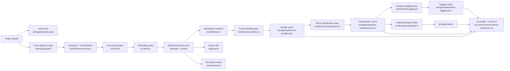

# Final Design Document

## 1. Purpose

EB1A Evidence Studio is a local-first evidence intelligence system for EB1A preparation. It turns raw folder uploads into a structured review workspace while preserving the original source files and the intermediate AI reasoning layers.

The current product goal is not just storage. It is to progressively interpret evidence across multiple passes so the reviewer can move from raw files to legal framing without losing traceability:

1. individual document understanding
2. event-level grouping
3. EB1A criterion grouping
4. human review and override

## 2. Product principles

The implemented v3 product follows these operating rules:

1. AI does the first pass, the human does the final judgment.
2. Every uploaded folder is isolated and independently reviewable.
3. The original documents remain accessible throughout the workflow.
4. Each AI pass is separately rerunnable.
5. Later interpretation layers must not destroy earlier layers.
6. Review actions should be reversible and workspace-scoped.

## 3. End-to-end workflow

The live workflow is:

1. The reviewer enters the candidate name.
2. The reviewer optionally edits the active prompts in Prompt Library.
3. The reviewer uploads a folder and clicks `Index folder`.
4. The system runs the pipeline in order:
   - `Indexing`
   - `Bundling`
   - `Classifying`
   - `Tagging`
   - `Ready`
5. Once the workspace reaches `Ready`, the dashboard itself shows the review surface again.
6. The dedicated review page remains available for focused search and retrieval.

## 4. Architecture overview

## 5. Storage model

The system uses three local persistence layers.

### 5.1 Qdrant

Qdrant stores the document record and embedding together. Each point includes:

- workspace identity
- candidate name
- file metadata
- processing state
- summary payload
- criteria tags
- review status
- notes and pin state
- OpenAI usage metadata

Qdrant powers:

- workspace retrieval
- semantic search
- persistent vector storage
- evidence-level review metadata

### 5.2 JSON state

Derived and operational state is stored under `storage/state`.

- `settings.json`
  - candidate name
  - active prompts
  - model config
  - output root
- `jobs.json`
  - indexing jobs
  - progress
  - cancellation state
- `event-bundles.json`
  - per-workspace event bundling output
- `eb1a-classification.json`
  - per-workspace EB1A classification output
- `criteria-tagging.json`
  - per-workspace document tagging output
- `manual-overrides.json`
  - event and category overrides
- `review-state.json`
  - sub-bundles and review-specific UI state

### 5.3 Filesystem

The filesystem stores:

- original uploads in `storage/uploads`
- preview artifacts in `storage/previews`
- output packages in `storage/exports`
- Qdrant local files in `storage/qdrant`

## 6. Workspace isolation

Every uploaded folder becomes its own isolated workspace identified by `jobId`.

Isolation is enforced in:

- document retrieval
- semantic search
- preview routes
- source file routes
- event bundle caches
- classification caches
- tagging caches
- manual overrides
- output package generation

This means `folder1` evidence never appears in `folder2` review output unless the reviewer explicitly switches workspaces.

## 7. Multi-pass intelligence

### 7.1 Pass 1: document summarization

Each reviewable file is extracted, summarized, and embedded.

The summary pass produces:

- title
- short summary
- detailed summary
- entities
- tags
- document type
- primary date
- confidence

The document pass is deliberately EB1A-light. It captures grounded meaning first.

### 7.2 Pass 2: event bundling

The bundling pass groups related files into real-world events such as:

- speaking engagements
- judging activity
- employment roles
- research and authorship efforts
- project or initiative evidence

Bundle output includes:

- bundle name
- short and detailed summary
- event type
- latest relevant date
- organizations
- people
- keywords
- lead document
- evidence document ids

The bundle layer is stored outside Qdrant because it is a workspace interpretation layer, not a retrieval primitive.

### 7.3 Pass 3: bundle-level EB1A classification

Completed event bundles are assigned into:

- standard EB1A criteria
- `Archive Category`
- `Unwanted`
- `Human Review`

This pass also generates the output package metadata used for downstream export.

### 7.4 Pass 4: document-level evidence tagging

The V3 rebuild adds a final AI tagging pass after bundle classification.

This pass works at the individual evidence file level and produces:

- criterion tags
- tag role
  - `primary`
  - `supporting`
- AI confidence
- AI reasoning
- default review state
  - `kept`
  - `pending`
  - `archived`

The tagging layer is downstream of classification, but it does not replace the earlier bundle or criterion layers. It enriches them for human review.

## 8. Criteria and review model

The review system now has three nested lenses:

1. `criterion`
2. `event bundle`
3. `evidence file`

This allows the reviewer to inspect:

- the legal bucket
- the real-world event
- the exact file supporting it

Each evidence file can also carry its own criteria suggestions and status independent of the parent bundle.

## 9. Review UX

### 9.1 Dashboard

The dashboard is responsible for:

- candidate identity
- workspace picker
- folder upload
- pipeline progress
- high-level metrics
- review surface once the workspace is truly ready

The dashboard intentionally hides the full review surface until the `Ready` stage is complete.

### 9.2 Dedicated review page

The dedicated review page remains available at `/review/<jobId>` for:

- semantic search
- keyword filtering
- deeper review interaction
- focused override work

### 9.3 View modes

The ready review surface supports:

- `By bundle`
- `By criterion`

### 9.4 Evidence actions

Evidence rows support:

- quick peek
- keep
- archive
- remove
- drag/drop reassignment
- criteria editing
- right-click actions
- multi-select bulk actions

### 9.5 Sub-bundles

Users can create review-only sub-bundles inside a parent event bundle for cleaner drill-down, for example:

- production systems
- metrics evidence
- supporting correspondence

Sub-bundles are user-authored organization state, not AI-generated event state.

## 10. Coverage model

The coverage rail is driven from document-level criteria tags.

Each criterion is marked as:

- `strong`
- `partial`
- `empty`

The current implemented rule set is:

- `strong`
  - at least one kept primary document
  - or at least two kept supporting documents
- `partial`
  - at least one kept supporting document only
- `empty`
  - no kept tagged evidence

This lets the reviewer track first-prong criterion coverage while still working through evidence.

## 11. Prompt library

The Prompt Library now has three active prompt types:

- summary prompt
- classification prompt
- tagging prompt

Only the active prompt text is stored. Historical prompt versions are intentionally not persisted.

Prompt changes invalidate the relevant downstream state and trigger regeneration when the workspace is reopened.

## 12. Manual override model

Humans can override at any time.

Supported overrides:

- move a file into a different event bundle
- move a bundle into a different EB1A category
- change evidence criteria
- keep, archive, or remove evidence
- create or rename sub-bundles
- add notes or pin evidence

Overrides are stored separately from the AI-generated base layers so the system can preserve both the machine interpretation and the human correction.

## 13. Filename routing rules

Deterministic filename routing still applies before final review:

- filenames containing `archive` -> `Archive Category`
- filenames containing `delete` or `remove` -> `Unwanted`

These rules intentionally win over AI classification for cleanup-oriented files.

## 14. Output packaging

The classification layer writes a downstream package under `storage/exports`.

Each output package contains:

- criterion-organized evidence folders
- copied source references
- index files
- classification summary
- human review summary
- source reference map

Manual overrides regenerate the effective output package without rewriting the original files.

## 15. Migration behavior

Older workspaces are preserved, but downstream caches now re-run automatically when needed.

Examples:

- bundling version changes
- classification prompt changes
- tagging version changes
- event bundle timestamp changes
- classification timestamp changes

This allows new UI and tagging capabilities to be applied to existing indexed workspaces without re-uploading the original folders.

## 16. API surface

Key route groups:

- ingestion
  - `/api/ingest`
- workspace snapshot and search
  - `/api/library`
  - `/api/search`
  - `/api/coverage`
- tagging
  - `/api/tag/start`
  - `/api/tag/retry`
  - `/api/tag/status`
- evidence review
  - `/api/evidence/:id/status`
  - `/api/evidence/bulk-status`
  - `/api/evidence/:id/criteria`
  - `/api/evidence/:id/criteria/:code`
  - `/api/evidence/:id`
  - `/api/evidence/:id/move`
  - `/api/evidence/bulk-move`
- sub-bundles
  - `/api/bundles/:id/sub-bundles`
  - `/api/sub-bundles/:id`

## 17. Validation completed for this version

This V3 rebuild was validated with:

- `npm run lint`
- `npm run build`
- live dashboard validation at `http://localhost:3001`
- live dedicated review validation at `http://localhost:3001/review/<jobId>`
- semantic search
- evidence status patch and revert
- criteria add/delete
- notes and pin save/revert
- sub-bundle create/rename/delete
- cross-bundle move and revert
- tagging status endpoint verification

## 18. Known limitations

- OCR quality still depends on the extracted text available from the source file or preview pipeline.
- Evidence tagging is intentionally downstream of EB1A classification, so a workspace is not considered fully ready until that final pass completes.
- Older workspaces may perform one catch-up rerun of newer downstream passes when opened after versioned pipeline changes.
